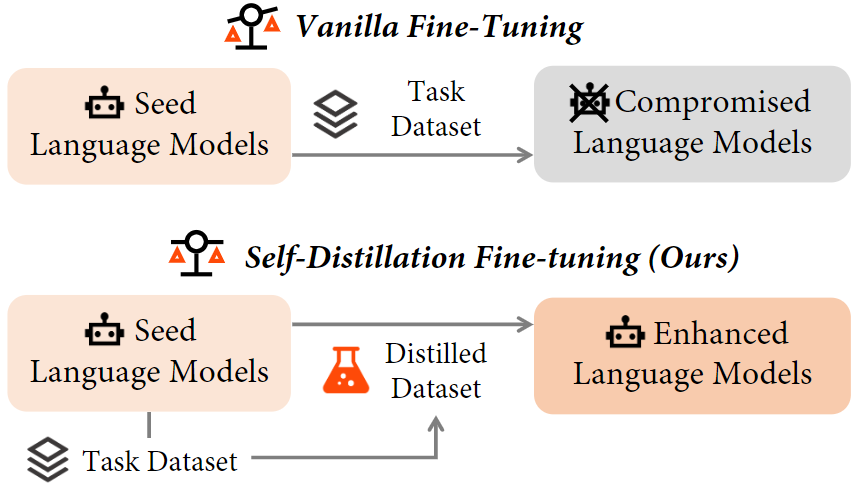

# Implementation for Self-Distillation Bridges Distribution Gap in Language Model Fine-Tuning

Here is the code for our work [Self-Distillation Bridges Distribution Gap in Language Model Fine-Tuning](https://aclanthology.org/2024.acl-long.58). 

## Update

- This paper gets accepted by ACL 2024 and final version is available on [arXiv](https://arxiv.org/abs/2402.13669).

- We integrade scripts for utilizing the [Meta-Llama-3-8B-Instruct](https://huggingface.co/meta-llama/Meta-Llama-3-8B-Instruct) model to conduct experiments on the [openfunction](https://github.com/ShishirPatil/gorilla/tree/main/openfunctions) dataset. The scripts are available in [scripts_llama3](scripts_llama3).

## Introduction
Fine-tuning LLMs for downstream tasks frequently leads to catastrophic forgetting, negatively affecting models' perfromance on other tasks and alignment. To address the problem, we introduce Self-Distillation Fine-Tuning (SDFT), a novel approach that bridges the distribution gap by guiding fine-tuning with a distilled dataset generated by the model itself to match its original distribution. The workflow of SDFT is shown in the following figure:



To ensure the quality of distilled responses, we employ simple heuristics. For responses that are not qualified, we preserve original response. 

This selection process is implementd in [eval/gen_distilled_data.py](eval/gen_distilled_data.py). Initially, we exclude responses containing specific words, which typically signify irrelevant repetitions rather than meaningful replies. Subsequently, for datasets pertaining to downstream tasks, we isolate the final answer and remove any that are inconsistent.

To facilitate the self-distillation process, a minor modification was implemented in the source code of LLaMA-Factory, as detailed in [this commit](https://github.com/rickyang1114/LLaMA-Factory/commit/6ca8c1a00f6066e4bf46c0620b3ed4870435dff0).

## Setup
Clone the repo with submodules:
```bash
git clone --recurse-submodules https://github.com/sail-sg/sdft.git
```

Install all dependencies via:
```bash
pip install -r requirements.txt
pip install -e LLaMA-Factory
pip install -e bigcode-evaluation-harness
```

Our experiments are based on [Llama-2-chat-7b-hf](https://huggingface.co/meta-llama/Llama-2-7b-hf) model, so it is necessary to obtain the appropriate grant.

## Usage
All required bash scripts for replicating the experimental results are located in the [scripts](scripts) directory. Prior to execution, ensure that the `model_path` argument is accurately configured. This argument denotes the identifier on Hugging Face or the local path containing the weights of the language model intended for fine-tuning.

To evaluate the seed language model, execute the following command: `bash scripts/test_seed_LM.sh`

For vanilla fine-tuning on a specific task dataset, use: `bash scripts/[dataset]/sft.sh`

For instance, to fine-tune on the Alpaca dataset, the command is: `bash scripts/alpaca/sft.sh`

Similarly, to perform Self-Distillation Fine (SDFT), the corresponding command is: `bash scripts/[dataset]/sdft.sh`

**The `main` branch has been subjected to refactoring, potentially introducing minor discrepancies. For precise replication of the results presented in the paper, it is recommended to utilize the `reproduce` branch.**

## Structure
The [data](data) directory houses the datasets utilized for fine-tuning and evaluation. After SDFT, corresponding distilled dataset will be created, denoted by a filename beginning with `distilled`.

The [eval](eval) directory encompasses Python files that are used for evaluation purposes.

The [checkpoints](checkpoints) directory stores the LoRA checkpoints, which are generated subsequent to the fine-tuning process.

Within the [predictions](predictions) directory, one can find the outputs generated for each benchmark following the evaluation phase.

Lastly, the [results](results) directory contains logs of the evaluation results.


## Acknowledgement
Our implementation is based on [LLaMA-Factory](https://github.com/hiyouga/LLaMA-Factory), for which we are thankful for the exceptional work. For evaluation purposes, we employ tools including [AlpacaEval](https://github.com/tatsu-lab/alpaca_eval), [lm-evaluation-harness](https://github.com/EleutherAI/lm-evaluation-harness), and [bigcode-evaluation-harness](https://github.com/bigcode-project/bigcode-evaluation-harness). Both AlpacaEval and lm-evaluation-harness are included as dependencies in `requirements.txt`, while LLaMA-Factory and bigcode-evaluation-harness have been integrated as a Git submodule.

To facilitate the self-distillation process, we created a fork of [LLaMA-Factory](https://github.com/hiyouga/LLaMA-Factory) at [this repository](https://github.com/rickyang1114/LLaMA-Factory), incorporating a modification to a single line of code.

## Citation
If you find our paper helpful, consider citing us via:
```
@inproceedings{yang-etal-2024-self,
    title = "Self-Distillation Bridges Distribution Gap in Language Model Fine-Tuning",
    author = "Yang, Zhaorui  and
      Pang, Tianyu  and
      Feng, Haozhe  and
      Wang, Han  and
      Chen, Wei  and
      Zhu, Minfeng  and
      Liu, Qian",
    editor = "Ku, Lun-Wei  and
      Martins, Andre  and
      Srikumar, Vivek",
    booktitle = "Proceedings of the 62nd Annual Meeting of the Association for Computational Linguistics (Volume 1: Long Papers)",
    month = aug,
    year = "2024",
    address = "Bangkok, Thailand",
    publisher = "Association for Computational Linguistics",
    url = "https://aclanthology.org/2024.acl-long.58",
    pages = "1028--1043",
}
```
